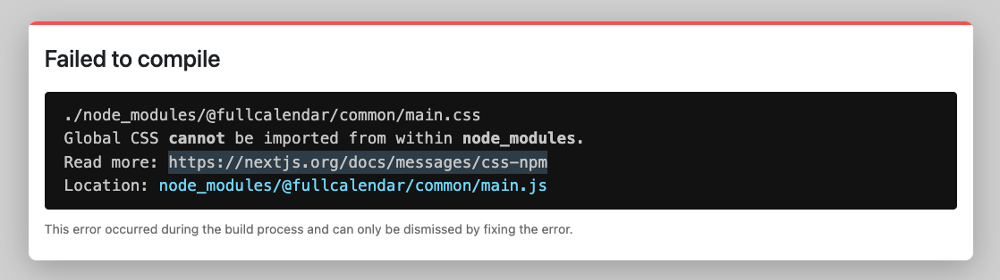

# Nextjs에서 Fullcalendar 사용하기

## Fullcalendar 설치하기

```shell

yarn add @fullcalendar/react @fullcalendar/daygrid

```

## import Fullcalendar

```tsx

import FullCalendar from "@fullcalendar/react";
import dayGrid from "@fullcalendar/daygrid";
import React from "react";

const Calendar = () => {
  return (
    <div>
      <FullCalendar plugins={[dayGrid]} />
    </div>
  );
};

export default Calendar;

```

그런데 다음과 같은 에러가 발생한다.



## next.config.js 수정하기

위 문제를 해결하기 위해 다음 패키지를 설치하고 config를 수정해준다.

```shell

yarn add next-transpile-modules

```

```js
// next.config.js

/** @type {import('next').NextConfig} */
const withTM = require("next-transpile-modules")([
  "@fullcalendar/common",
  "@fullcalendar/react",
  "@fullcalendar/daygrid",
]);
module.exports = withTM({});

```


